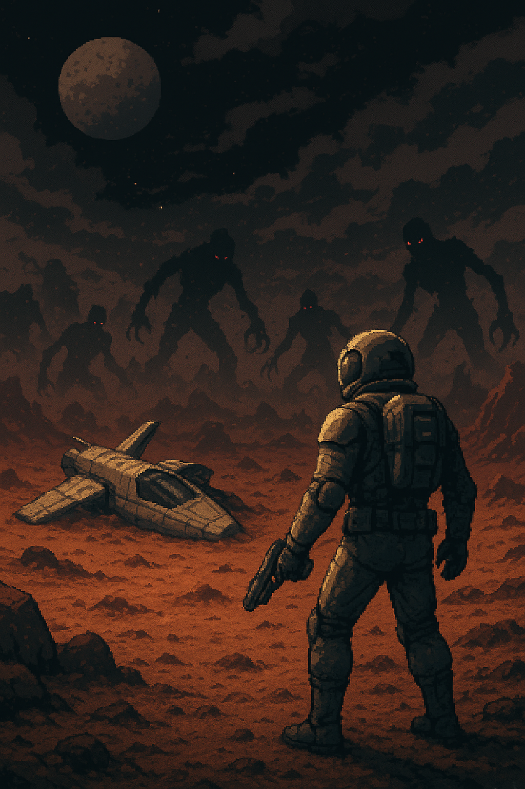
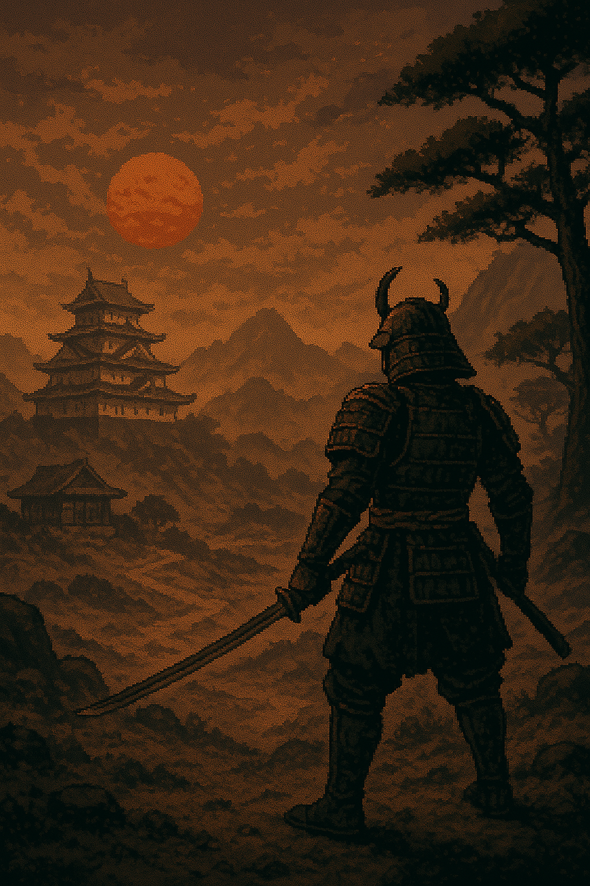

# Idées de Background

### Exploration spatiale
- Originaire d'une colonie spatiale futuriste, vous êtes le capitaine d'un vaisseau scientifique d'exploration crashé sur une planète inconnue et rapidement, vous comprenez le caractère hostile de celle-ci.
- Des bruits et des ombres s'agitent sur une terre aride et poussiéreuse qui semblait pourtant déserte, il va falloir survivre et
  qui sait peut-être découvrir d'autres formes de vie, matériel ou même des civilisations oubliées.
- Différente voit s'offriront à vous : la Science, la Diplomatie, la Survie ou même la Guerre.

### Japon féodal
- Vous êtes un guerrier samouraï au service d'un seigneur local. Votre mission est de protéger votre seigneur et son territoire contre les envahisseurs.
- Vous pourrez apprendre de vos ennemis en les combattant, développer vos compétences en arts martiaux et en stratégie, et peut-être même découvrir des secrets cachés dans les montagnes environnantes.
- Différentes voies s'offriront à vous : la Loyauté, l'Honneur, la Vengeance ou la Rédemption.

### Guerrier du labyrinthe cosmique
- Vous êtes un guerrier intergalactique piégé dans l'administration de l'Entropie, confiné à
un étage infini d'un labyrinthe cosmique dont la structure change aléatoirement.
- Votre mission est naviguer et survivre dans ce labyrinthe, en affrontant des créatures étranges et en résolvant des énigmes pour trouver une sortie.
- Différentes voies s'offriront à vous : la Connaissance, la Folie, la Liberté ou la Domination.

